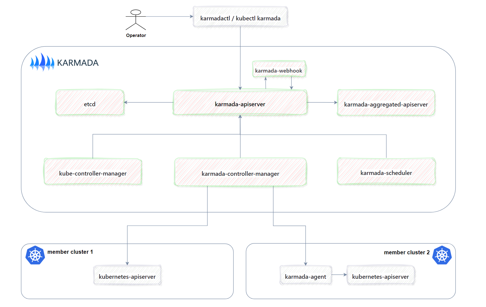

This document provides an overview of the components required for a fully functional and operational Karmada setup.

## Essential Components

### karmada-apiserver

This component uses the official image of Kubernetes and plays a crucial role in handling API requests,

facilitating communication with the karmada-aggregated-apiserver, various controllers, karmada-scheduler,

karmada-webhook, and persisting data in etcd.

### karmada-aggregated-apiserver

This component is used to access resources on the member cluster through karmada-apiserver, 

achieving unified authentication on the Karmada control plane and authentication through user impersonation.

The resources installed in the aggregate apiserver include clusters, clusters/status, clusters/proxy.

### kube-controller-manager

This component uses the official image of Kuberntes, the difference is that only several controllers are 

enabled such as namespace, garbagecollector, serviceaccount-token controllers.

> When users submit Deployment or other Kubernetes standard resources to the karmada-apiserver,
>
> they are solely recorded in the etcd of the Karmada control plane. Subsequently, these resources are
>
> synchronized with the member cluster. However, it's important to note that these Deployment resources
>
> do not undergo reconciliation processes (such as pod creation) in the Karmada control plane cluster.

### karmada-controller-manager

This component performs operations based on the API objects you created through the karmada-apiserver

This component runs various controllers, which watch karmada objects and then talk to the underlying 

clusters' API servers to create regular Kubernetes resources.

1. Cluster Controller: attaches kubernetes clusters to Karmada for managing the lifecycle of the clusters by creating cluster objects.

2. Policy Controller: watches PropagationPolicy objects. When a PropagationPolicy object is added, the controller selects a group of 

   resources matching the resourceSelector and create ResourceBinding with each single resource object.

3. Binding Controller: watches ResourceBinding objects and create a Work object corresponding to each cluster with a single resource manifest.

4. Execution Controller: watches Work objects. When Work objects are created, the controller will distribute the resources to member clusters.

### karmada-scheduler

This component is responsible for scheduling k8s native API resource objects (including CRD resources) to member clusters, 

including scheduling strategies and timing. At the same time, it also supports extending scheduling capabilities through plugins.

For some resource objects that need to calculate the replica ratio, the scheduling plugin will first filter out some clusters, 

and then make a decision on the number of replicas that the resource object should distribute in each cluster.

### karmada-webhook

This component is responsible for verifying the format of resources object which is in the charge of , 

as well as intercepting and modifying relevant data before it entering the ETCD.

### etcd

Consistent and highly-available key value store used as Karmada' backing store for all karmada API objects. 

### karmada-agent

Karmada has two manage mode such as Push and Pull, karmada-agent shall be deployed on each Pull mode member cluster, 

responsible for actively pulling workload from the control plane, and applying it to current member cluster. 

Besides, the agent also in charge of collecting and reporting current cluster status to control plane.

## Addons

### karmada-scheduler-estimator

This component is responsible for providing the karmada-scheduler with a more precise desired state of the running instances of the 

member cluster. Early karmada-scheduler only supported scheduling the number of replicas based on the total number of cluster resources. 

In this case, scheduling failure occurred when the total cluster resources were sufficient but each node resources were insufficient.

To address this issue, the estimator component was introduced, which calculates the number of callable replicas for each node 

based on resource requests, thereby calculating the true number of schedulable replicas for a cluster.

### karmada-descheduler

This component is a cronjob responsible for detecting all Deployments at regular intervals (every 2 minutes by default), 

and triggering reschedule based on instance state changes in member clusters. 

The descheduler only takes effect when the scheduling strategy is dynamic division 

and it perceives how many instance state has changed by calling scheduler-estimator.

### karmada-search

Karmada search is used to cache resource objects and events deployed in member clusters, 

and to provide retrieval services externally through search APIs.

Unlike the query services provided by the aggregation API, cache retrieval does not require accessing the target cluster 

and is targeted at scenarios that require frequent data search and analysis, such as building real-time resources and event dashboards.

### karmadactl

Users can use karmadactl as client to enjoy karmada, such as performing join/unjoin of a member cluster, 

mark/unmark a member cluster as non schedulable and so on.

### kubectl karmada

kubectl karmada provides capabilities in the form of kubectl plugins, yet its realization is exactly the same as karmadactl.

