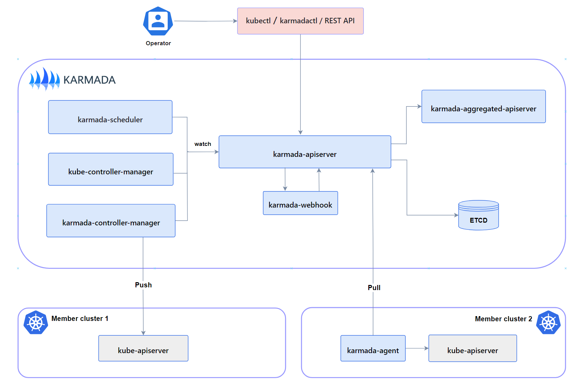

本文档概述了一个功能完整且正常工作的 Karmada 所需的组件。

## Control Plane Components

一个完整且可工作的 Karmada 控制平面由以下部件组成。karmada-agent 可能是可选的，这取决于
[集群注册模式](../userguide/clustermanager/cluster-registration)。

### karmada-apiserver

API 服务器是 Karmada 控制平面的一个组件，对外暴露 Karmada API 以及 Kubernetes 原生API。API 服务器是 Karmada 控制平面的前端。

Karmada API 服务器是直接使用 Kubernetes 的 kube-apiserver 实现的，因此 Karmada 与 Kubernetes API 自然兼容。
这也使得 Karmada 更容易实现与 Kubernetes 生态系统的集成，例如允许用户使用 kubectl 来操作 Karmada、
[与 ArgoCD 集成](../userguide/cicd/working-with-argocd)、[与 Flux 集成](../userguide/cicd/working-with-flux) 等等。

### karmada-aggregated-apiserver

聚合 API 服务器是使用 [Kubernetes API 聚合层](https://kubernetes.io/zh-cn/docs/concepts/extend-kubernetes/api-extension/apiserver-aggregation/) 
技术实现的扩展 API 服务器。它提供了 [集群 API](https://github.com/karmada-io/karmada/blob/master/pkg/apis/cluster/types.go)
以及相应的子资源，例如 cluster/status 和 cluster/proxy，实现了 [聚合 Kubernetes API Endpoint](../userguide/globalview/aggregated-api-endpoint)
等可以通过 karmada-apiserver 访问成员集群的高级功能。

### kube-controller-manager

kube-controller-manager 由一组控制器组成，Karmada 只是从 Kubernetes 的官方版本中挑选了一些控制器，以保持与原生控制器一致的用户体验和行为。

值得注意的是，并非所有的原生控制器都是 Karmada 所需要的，
推荐的控制器请参阅 [Recommended Controllers](../administrator/configuration/configure-controllers#required-controllers).

> 注意：当用户向 Karmada API 服务器提交 Deployment 或其他 Kubernetes 标准资源时，它们只记录在 Karmada 控制面的etcd中。
> 随后，这些资源会向成员集群同步。然而，这些部署资源不会在 Karmada 控制面集群中进行 reconcile 过程（例如创建 Pod）。

### karmada-controller-manager

Karmada 控制器管理器运行了各种自定义控制器进程。

控制器负责监视Karmada对象，并与底层集群的API服务器通信，以创建原生的 Kubernetes 资源。

所有的控制器列举在 [Karmada 控制器](../administrator/configuration/configure-controllers/#karmada-controllers)。

### karmada-scheduler

karmada-scheduler 负责将 Kubernetes 原生API资源对象（以及CRD资源）调度到成员集群。

调度器依据策略约束和可用资源来确定哪些集群对调度队列中的资源是可用的，然后调度器对每个可用集群进行打分排序，并将资源绑定到最合适的集群。

### karmada-webhook

karmada-webhook 是用于接收 karmada/Kubernetes API 请求的 HTTP 回调，并对请求进行处理。 你可以定义两种类型的 karmada-webhook，即验证性质的 webhook 和修改性质的 webhook。
修改性质的准入 webhook 会先被调用。它们可以更改发送到 Karmada API 服务器的对象以执行自定义的设置默认值操作。

在完成了所有对象修改并且 Karmada API 服务器也验证了所传入的对象之后， 验证性质的 Webhook 会被调用，并通过拒绝请求的方式来强制实施自定义的策略。

> 说明：如果 Webhook 需要保证它们所看到的是对象的最终状态以实施某种策略。则应使用验证性质的 webhook，因为对象被修改性质 webhook 看到之后仍然可能被修改。

### etcd

一致且高可用的键值存储，用作 Karmada 的所有 Karmada/Kubernetes 资源对象数据的后台数据库。

如果你的 Karmada 使用 etcd 作为其后台数据库， 请确保你针对这些数据有一份 备份计划。

你可以在官方[文档](https://etcd.io/docs/)中找到有关 etcd 的深入知识。

### karmada-agent

Karmada 有 Push 和 Pull 两种 [集群注册模式](../userguide/clustermanager/clusterregistration)， karmada-agent 应部署在每个 Pull 模式的成员集群上。
它可以将特定集群注册到 Karmada 控制面，并将工作负载清单从 Karmada 控制面同步到成员集群。 
此外，它也负责将成员集群及其资源的状态同步到Karmada控制面。

## Addons

### karmada-scheduler-estimator

Karmada 调度估计器为每个成员集群运行精确的调度预估，它为调度器提供了更准确的集群资源信息。

> 注意：早期的 Karmada 调度器只支持根据集群资源的总量来决策可调度副本的数量。
> 在这种情况下，当集群资源的总量足够但每个节点资源不足时，会发生调度失败。
> 为了解决这个问题，引入了估计器组件，该组件根据资源请求计算每个节点的可调度副本的数量，从而计算出真正的整个集群的可调度副本的数量。

### karmada-descheduler

Karmada 重调度组件负责定时检测所有副本（默认为两分钟），并根据成员集群中副本实例状态的变化触发重新调度。

该组件是通过调用 karmada-scheduler-estimator 来感知有多少副本实例状态发生了变化，并且只有当副本的调度策略为动态划分时，它才会发挥作用。

### karmada-search

Karmada 搜索组件以聚合服务的形式，提供了在多云环境中进行全局搜索和资源代理等功能。

其中，[全局搜索](../tutorials/karmada-search/) 能力是用来跨多个集群缓存资源对象和事件，以及通过搜索 API 对外提供图形化的检索服务；
[资源代理](../userguide/globalview/proxy-global-resource/) 能力使用户既可以访问 Karmada 控制面所有资源，又可以访问成员集群中的所有资源。

## CLI tools

### karmadactl

Karmada 提供了一个命令行工具 karmadactl，用于使用 Karmada API 与 Karmada 的控制平面进行通信。

你可以使用 karmadactl 执行成员集群的添加/剔除，将成员集群标记/取消标记为不可调度，等等。
有关包括 karmadactl 操作完整列表在内的更多信息，请参阅
[karmadactl](../reference/karmadactl/karmadactl-commands/karmadactl).

### kubectl karmada

kubectl karmada 以 kubectl 插件的形式提供功能，但它的实现与 karmadactl 完全相同。
